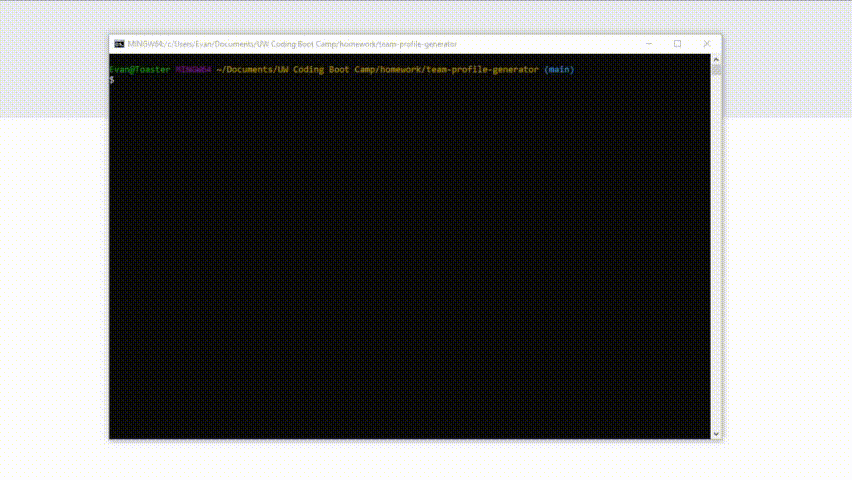

# Team Profile Generator

## Description

A command line application that generates an html page for a company's team member information based on a series of user inputs

---

## Table of Contents
  * [Installation](#installation)
  * [Usage](#usage)
  * [License](#license)
  * [Contribution](#contribution)
  * [Questions](#questions)
    
---

## Installation

To install, ensure that you have node.js installed and then run the commands 'npm init' followed by 'npm i inquirer'

---

## Usage

To use, simply run 'node index.js' into your command line, and then follow the proceeding prompts to input information about your team members
    

---

## License
        
  This application is unlicensed.
    
---

## Contributing

If you'd like to contribute, please contact me via the links in the [Questions](#questions) section below.
        
---

## Tests

Refer to the [Usage](#usage) section for usage instructions. Follow the instructions to test the functionality of this application.

---

## Questions
        
  Feel free to contact me via one of the links below with any questions you may have.

  GitHub: [evanhosni](https://github.com/evanhosni)

  Email: [evankhaledhosni@gmail.com](mailto:evankhaledhosni@gmail.com)
